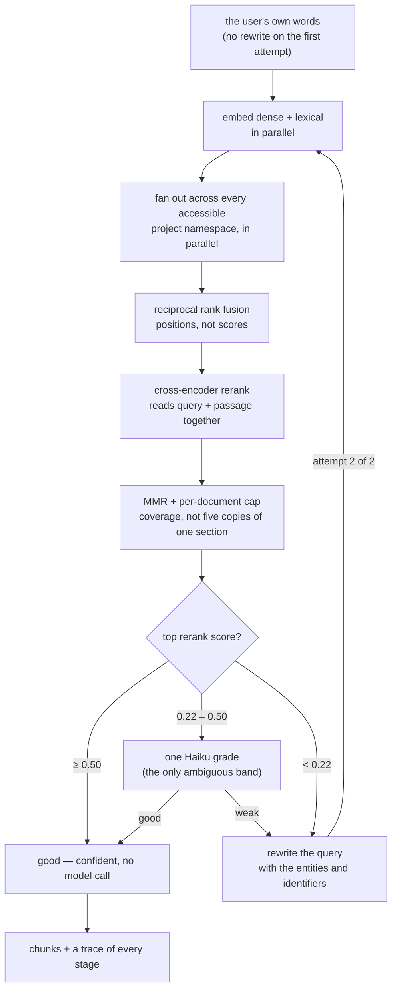
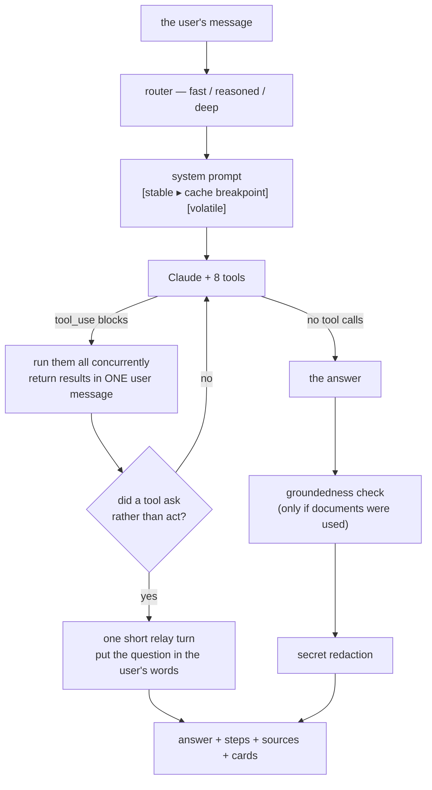

# Agentic RAG — the retrieval loop and the agent

`docs/RAG.md` is the end-to-end walkthrough. This is the deep dive on the two loops that decide answer quality: **how retrieval decides it has found enough**, and **how the agent decides what to do**.

---

## 1. What "agentic" means here

Plain RAG is one shot: embed the question, fetch the top *k*, generate. If the retrieval was bad, the answer is bad, and nothing in the system notices.

Agentic RAG adds judgement at two levels:

- **Inside retrieval** — the pipeline assesses its own results and retries with a different query if they are weak.
- **Above retrieval** — the agent decides *whether* to search at all, *what* to search for, *which profile* to use, and whether it has enough to answer or should ask the user instead.

---

## 2. The retrieval loop



### 2.1 The two changes that matter

The loop this replaces rewrote the query with an LLM **before every single search**, then graded the result with a second LLM call. A plain lookup cost two model calls before generation had even started.

**The first attempt now uses the user's own words.** Embeddings handle natural language perfectly well — that is what they are for — so rewriting up front spends latency to solve a problem that usually is not there. The rewrite is held back as the *recovery* path, where it earns its cost.

**The grade is replaced by the reranker's own score.** A cross-encoder that has already read the query and the passage together is a better judge of relevance than a Haiku call asking "good or weak" — and it is *free*, because it has already run. An LLM grade is spent only when the score lands in the ambiguous band between 0.22 and 0.50, where a second opinion is genuinely worth a few hundred milliseconds.

**Result: zero LLM calls on the common path, at most two on the recovery path, against a guaranteed two before.**

Measured on a live index, a confident lookup now reads:

```
hybrid: 3 dense + 0 lexical candidate(s) | reranked to 3, top score 0.93 | confident on rerank score 0.93
```

Three stages, one round trip each, no model call.

### 2.2 Why the thresholds are where they are

Voyage rerank scores sit in [0, 1]. Above **0.50** the reranker is sure enough that an LLM grade adds latency and nothing else. Below **0.22** it is plainly weak and a second opinion would only confirm it. Only the band between is worth paying for.

Both are `RERANK_CONFIDENT_SCORE` and `RERANK_WEAK_SCORE` in the environment. Raise the first if you see confident-but-wrong answers; lower it if grading is firing too often.

### 2.3 Best-so-far

Each attempt keeps the best chunk set seen, compared by top score. If the rewrite retrieves *worse* than the original query — which happens — the original result is what comes back. A retry can never make the answer worse than not retrying.

---

## 3. The agent loop



### 3.1 The tools

| Tool | What it is for |
|---|---|
| `search_knowledge` | Documents. Takes a `mode` — the agent picks the retrieval profile itself |
| `list_tasks` | The only source of truth about work items. Filters by project, assignee, parent, status, time |
| `create_task` | Exactly one task |
| `create_tasks` | A whole nested tree in one call — and the approval gate above the threshold |
| `update_task` | Status, priority, due date, title. Refuses on an ambiguous match |
| `summarize_project` | Tasks + the `summarize` retrieval profile over that project |
| `ask_user` | Hand a question back with option buttons, instead of guessing |
| `request_example` | Ask for a sample before writing something format-sensitive |
| `save_example` | Store that sample so it is never asked for twice |

**Tool descriptions are part of the prompt.** A description is the only documentation the model gets, and a vague one produces a wrong call that costs a whole extra round trip to discover. Every description says what the tool does, when to reach for it, **when not to**, and what its arguments mean — including the cases where a different tool is the right answer. They are written for a model deciding under uncertainty, not for a developer reading an API reference.

Concretely: `create_task`'s description says *"DO NOT USE FOR: several tasks, or any task that has subtasks — use create_tasks... Calling this in a loop produces orphaned tasks and wastes the turn."* That one sentence removes an entire failure mode.

### 3.2 Parallel tool calls

One assistant message may contain several `tool_use` blocks. They are executed **concurrently** and their results returned in a **single** user message. Splitting results across messages silently teaches the model to stop making parallel calls at all — which costs a round trip on every multi-tool turn thereafter.

A tool that throws returns `is_error: true` rather than propagating. The model can often recover by calling something else, and dropping the result entirely would leave the conversation in a shape the API rejects.

### 3.3 Asking as a first-class outcome

`ask_user` and `request_example` set a **flag on the tool context**, not an exception. An exception would be fed back to the model as a tool failure to recover from, turning a deliberate question into what looks like a bug.

When the flag is set, the loop stops and spends one short, thinking-free relay turn putting the question into the user's language, with the card carrying the options. If the model answers around the question instead, the tool's own message is the fallback.

### 3.4 Prompt caching, and how to break it

The system prompt is two blocks:

```
[ STABLE — persona, tool guidance, accuracy rules ]  ← cache_control: ephemeral
[ VOLATILE — user name, today's date, project list, conversation summary ]
```

The stable half is byte-identical for every user on every request, so it sits in the cached prefix and is re-read at a fraction of the input price.

**Two rules, both easy to break by accident:**

1. Anything time-varying, user-varying or conversation-varying must live in the volatile half. One timestamp in the stable half silently disables the cache for *everyone*, with no error anywhere.
2. The tool list must not be rebuilt in a different order between turns. Tools render *before* the system prompt, so a reordered tool array invalidates everything after it.

Verify with `usage.cache_read_input_tokens`. If it is zero across repeated turns, something above is wrong.

### 3.5 Model tiering

| Tier | Trigger | Model | Thinking |
|---|---|---|---|
| `fast` | ≤ 8 words with no planning language; anything else that is a plain lookup | Haiku 4.5 | none |
| `reasoned` | "summarise", "each", "phases", "subtasks"; > 45 words; deep history | Haiku 4.5 | explicit budget |
| `deep` | "plan", "compare", "why", "recommend", "should we", "break X into Y" | Sonnet 5.5 | adaptive + effort |

A heuristic, not a model call — a model call to decide how much model to use sits on the critical path of every turn and costs the latency it exists to save. Getting it wrong is cheap in both directions.

`historyDepth` and `hasSummary` feed the classifier because a turn arriving late in a long conversation carries more to hold together, and a bare *"yes, do that"* can trigger the largest action in the session.

---

## 4. Failure modes and what catches them

| Failure | Caught by |
|---|---|
| Retrieval returns nothing relevant | Confidence gate → rewrite and retry |
| Retrieval returns five copies of one section | MMR + per-document cap |
| A rare code or id is missed | The lexical leg (when hybrid is on) + the rewrite prompt asking for identifiers |
| The answer states something the sources do not | Groundedness check → caveat |
| A document contains an injected instruction | Untrusted framing → detection → containment |
| The model invents a task or a date | The prompt forbids it; `list_tasks` is the only source of truth |
| The model edits the wrong task | `update_task` refuses on an ambiguous match |
| The model creates eighteen wrong tasks | Approval gate above the threshold |
| The model loops forever | `MAX_TOOL_ROUNDS` = 6 |
| The reply is cut off mid-tool-call | `stop_reason: max_tokens` handled explicitly, with a plain explanation |
| A conversation contradicts its own earlier decisions | Rolling summary in the volatile prompt half |
| The reranker is down | Falls back to fusion order; the search still returns |
| The lexical service is down | Falls back to dense-only |
| Vector fetch for MMR fails | Falls back to lexical-overlap MMR |
| The cache is down | Cool-off, then treated as a miss |

The pattern throughout: **every optional component degrades rather than fails.** A cache that can take the service down is worse than no cache.

---

## 5. Tuning guide

| Symptom | Try |
|---|---|
| Answers miss facts that are in the documents | `CHUNK_TARGET_TOKENS` down; check the parser recovered structure (`parsing` in the ingest response) |
| Answers cite the same file repeatedly | Lower `lambda` or raise `perDocCap` for the profile |
| Retrieval is slow | `candidates` down; confirm the chunk-vector cache is warm (`/api/ready` → cache tier) |
| Rare codes and ids are missed | Turn on hybrid search (needs a dotproduct index) |
| Grading fires on most queries | `RERANK_CONFIDENT_SCORE` down |
| Confident but wrong | `RERANK_CONFIDENT_SCORE` up; `keep` up |
| Too expensive | `DEEP_MODEL_ENABLED=false`; `ANSWER_MAX_TOKENS` down; `CONTEXTUAL_RETRIEVAL_ENABLED=false` (costs recall) |
| Ingest too slow | `VISION_ENABLED=false` (loses scanned pages); `CONTEXT_CONCURRENCY` up |
| Agent asks too many questions | Raise `APPROVAL_TASK_THRESHOLD`; tighten the ask guidance in `persona.ts` |
