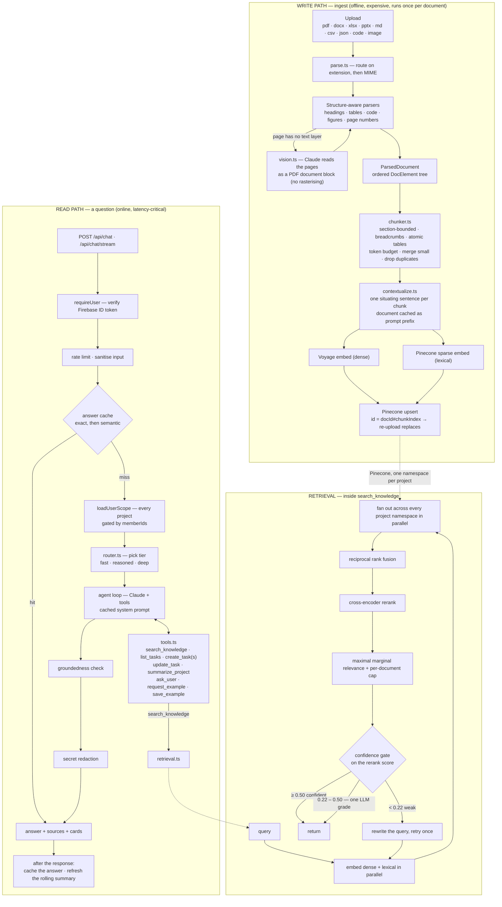

# RAG + the agent — how Lune AI's brain works

The full walkthrough of Lune AI's retrieval-augmented generation system and the agent on top of it: **what** each piece is, **how** it works, and **why** it was built that way. `docs/AGENTIC_RAG.md` goes deeper on the retrieval loop and the agent; `docs/SECURITY.md` covers the guardrails.

---

## 0. The 30-second mental model

A user asks a question. We do not send that question straight to the language model and hope. Instead:

1. **Retrieval** finds the handful of document passages most likely to answer it.
2. **Generation** hands those passages plus the question to Claude, which writes a grounded answer and can also read and write the user's tasks.

RAG = *retrieve the right context, then generate*. The model's job shifts from "remember everything" to "reason over what we handed it". That is what makes answers accurate and citable instead of confidently wrong.

Three models do the work, because they are good at different things:

| Job | Model | Why |
|---|---|---|
| Turn text into vectors | **Voyage `voyage-3.5`** (1024-dim) | Claude has no embedding endpoint. |
| Score (query, passage) relevance | **Voyage `rerank-2.5`** (cross-encoder) | A dedicated reranker is far more precise than raw vector similarity. |
| Lexical / rare-token matching | **`pinecone-sparse-english-v0`** | A learned sparse model. Optional — see §4. |
| Read, reason, answer, call tools | **Claude** — tiered per turn | See §7. |

---

## 1. The whole pipeline

Two paths. The **write path** runs at upload, where nobody is waiting, so it can afford to be expensive. The **read path** runs while a user watches a cursor blink, so every step has to earn its latency.



---

## 2. Why this architecture

**Why split embeddings and generation across two vendors?** Retrieval and generation are different problems. Embeddings need a model trained to place similar *meanings* near each other in vector space; generation needs a model trained to reason and write. Claude is excellent at the second and does not expose the first. Keeping them separate also means either side can be swapped without touching the other.

**Why RAG at all instead of stuffing everything into the prompt?** Cost and accuracy. Sending an entire document library on every question is expensive and dilutes the model's attention. Retrieving the relevant handful keeps the prompt small, cheap and focused, and lets us cite exactly what the answer came from.

**Why is the write path allowed to be slow?** Because it is offline. OCR, figure captioning and per-chunk contextualisation all happen once, at upload, and every question asked afterwards inherits the quality for free. The single most common mistake in a RAG system is doing at query time what could have been done at ingest time.

---

## 3. The write path

### 3.1 Parsing — structure, not a string

The old pipeline flattened every document to one string. That is the biggest quality loss available in a RAG system: without structure you cannot keep a table intact, you cannot tell a chunk which section it came from, and you cannot cite a page.

Every parser now returns a `ParsedDocument` — an ordered list of typed elements (`heading`, `paragraph`, `list`, `table`, `code`, `figure`), each knowing its level and page.

| Format | What is recovered |
|---|---|
| **pdf** | Headings from typography, tables from column positions, page numbers, running headers stripped, scanned pages OCR'd |
| **docx** | Heading styles, tables, lists — via mammoth's HTML conversion, not raw text |
| **xlsx** | One section per sheet, each sheet a Markdown table |
| **pptx** | One section per slide, tables, **speaker notes** (usually where the argument actually is) |
| **md** | Native structure: headings, fenced code, pipe tables |
| **csv / json** | Rendered as tables where the shape allows; quoted fields handled |
| **code** | Split on top-level definitions, one element per symbol, the symbol name as its heading |
| **images** | Transcribed *and* described by Claude vision |

The PDF parser is the interesting one. It reads the text layer *with positions*, which is enough to reconstruct:

- **Lines** — glyph runs grouped by baseline, ordered left to right, so a two-column page does not interleave into nonsense.
- **Headings** — a line set larger than the page's body text, short, not ending in a full stop. Its size relative to the document's other heading sizes gives it a level, so the heading tree comes out of typography rather than guesswork.
- **Tables** — a run of consecutive lines whose text starts at the same handful of x positions. Columns are recovered from those positions and emitted as a Markdown table.
- **Furniture** — a line appearing at the same height on most pages is a running header. Indexing it once per page fills the index with the document's own title answering every question.

**Scanned pages.** A page with an empty text layer is a scan. Rather than rasterising it (which in Node means pdf.js plus a native canvas binding — heavy, platform-specific, wrong for a serverless function), the pages are extracted into a small PDF with `pdf-lib` and sent to Claude as a **document block**, which the API reads natively including its embedded images. That is pure JS, needs no rendering, and lets four pages ride in one call instead of one call per page.

### 3.2 Chunking — the biggest lever after parsing

The old chunker was a 1000-character sliding window. It had no idea what it was cutting: a table lost its header halfway down and became a column of numbers; a paragraph three sections deep carried no clue which section it came from, so a chunk reading *"the interval moves to six months"* matched nothing, because the sentence naming the subject sat in a heading two elements earlier.

The new chunker works on the element tree:

| Property | What it does | Why |
|---|---|---|
| **Sections** | A chunk never crosses a heading boundary | Two adjacent sections are two different subjects; merging dilutes both embeddings |
| **Breadcrumbs** | `spec.pdf > Data pipeline > Charts` is prepended to the *embedded* text | The cheapest recall win available, and free at query time |
| **Atomicity** | Tables, code and figures emitted whole; an oversized table splits by rows **with its header repeated** | `\| 99.4 \| 2 \|` answers nothing |
| **Token budget** | Sizes in tokens, not characters | A table of numbers and a paragraph of prose have wildly different tokens per character |
| **Merge small** | Fragments fold into their neighbour in the same section | Six-word fragments are noise that crowd out real results |
| **Deduplicate** | Byte-identical chunks indexed once | Boilerplate otherwise occupies four slots in a top-5 with one passage's worth of information |
| **Overlap** | Within a section only | Overlapping across a heading duplicates content into a chunk about a different subject |

One deliberate detail: a chunk has a `text` (what the model reads and the UI shows) and an `embedText` (text + breadcrumb + generated context). Keeping them apart means retrieval context never leaks into a quoted answer; deriving the second from the first means the two cannot drift.

### 3.3 Contextual retrieval

A chunk pulled out of a document loses the context that made it meaningful. *"The interval moves to six months after the firmware upgrade"* is unsearchable on its own — nothing in it says rectifiers, Galle, or 2026.

So at ingest, Claude writes one or two sentences per chunk situating it in its document, and those are prepended to the embedded text.

The obvious objection is cost: sending the whole document with every chunk is quadratic. **Prompt caching removes it.** The document goes in a cached system block, so the first chunk pays to write the cache and every chunk after it reads it at a fraction of the input price. A fifty-page document costs cents.

*(Caveat: a model will not cache a prefix below its minimum cacheable length, so a short document pays full price per chunk. That is fine — a short document has few chunks — but the cache counters read zero on small files, which is expected rather than a misconfiguration.)*

### 3.4 Idempotent indexing

Vector ids are `{docId}#{chunkIndex}`, where `docId` is a hash of (project, filename). Three consequences:

1. **Re-uploading a file replaces it.** The old pipeline used a random UUID per chunk, so every re-upload silently doubled the document in the index — and a doubled document wins every search against itself.
2. **A shrinking document leaves no stale tail.** The previous version's vectors are deleted by id prefix before the new ones land, *and* the ids beyond the new chunk count are deleted explicitly by name afterwards. The second step exists because Pinecone's list API lags the write path by seconds — measured, not assumed — so a prefix delete issued right after an upsert can miss what it was meant to remove. Deleting by id is immediately consistent.
3. **Provenance travels.** Every vector carries its section path, page number, element kind and content hash, so a retrieved chunk can say where it came from.

---

## 4. Hybrid search — dense + lexical

Dense retrieval fails in a specific, predictable way: **rare tokens.** `RX-4471`, `BMPC 2026`, `kWh/kWp`, a surname, a ticket id — none of these have a meaningful position in embedding space, so a bi-encoder returns three paragraphs about rectifiers in general and misses the one naming the unit. A lexical index catches exactly those, and misses the paraphrases dense catches. Running both is why hybrid beats either alone on a corpus of work documents full of names, codes and acronyms.

`pinecone-sparse-english-v0` is a *learned* sparse model rather than plain BM25, so it also expands terms (a query for "faults" matches "alarm") with no corpus-wide IDF table to fit and persist.

**This is off by default.** Hybrid records need a `dotproduct` Pinecone index, and the live index is `cosine` — a property that cannot be changed in place. With `HYBRID_SEARCH_ENABLED=false` the lexical leg is skipped entirely and everything runs dense-only, exactly as before, so nothing has to be reindexed to deploy this. To turn it on: create a dotproduct index, point `PINECONE_INDEX_NAME` at it, set the flag, and re-ingest.

---

## 5. Fusion and diversity

**Reciprocal rank fusion** merges the two result lists. It works on *positions*, not scores, because the two scales are not comparable at all: a cosine similarity lives in [0, 1] while a learned sparse dot product is unbounded. Weighting raw scores would let the lexical leg swamp the dense one; RRF only asks "how high did each list rank this", so a passage ranked first by either leg is guaranteed to survive.

**Cross-encoder reranking** is the single biggest precision lever. The embedding search compares two vectors built independently, so it knows a passage is about the same topic but not whether it *answers the question*. A cross-encoder reads query and passage together, which is what separates "mentions rectifiers" from "says what the interval is".

**Maximal marginal relevance** picks the final set. A reranker sorted purely by relevance will happily return five near-identical chunks from the same section, which reads as five sources and is really one. MMR trades a little relevance for coverage. The **per-document cap** expresses a diversity MMR cannot: a question answered five times over from one file has *one* source, and the citations should say so.

---

## 6. Retrieval profiles

"Find me the rectifier's serial number" and "summarise this project" are not the same retrieval problem. One set of constants tuned to serve both serves neither.

| Profile | Candidates | Keep | λ | Per-doc cap | Grade | Rewrite | For |
|---|---|---|---|---|---|---|---|
| `lookup` | 20 | 5 | 0.82 | — | yes | yes | One specific fact. Lexical leg weighted up |
| `explore` | 40 | 8 | 0.55 | 3 | yes | yes | Open and comparative questions |
| `summarize` | 45 | 12 | 0.45 | 3 | no | yes | Broad coverage; nothing to grade against |
| `related` | 15 | 3 | 0.5 | 1 | no | no | Smart linking, runs while the user reads |

The agent **chooses the profile itself** via the tool's `mode` argument. The model knows whether it is asking for a fact or a survey far better than a heuristic on the query string can.

---

## 7. Model tiering

Running every turn on the strongest model with reasoning on is the easy way to good answers and the fastest way to a slow, expensive assistant.

| Tier | Model | Thinking | For |
|---|---|---|---|
| `fast` | Haiku 4.5 | none | Lookups, single tool calls, confirmations |
| `reasoned` | Haiku 4.5 | explicit budget | Multi-step work, several tools, order matters |
| `deep` | Sonnet 5.5 | adaptive + effort | Planning, comparison, judgement |

The classifier is a **heuristic, not a model call**. A model call to decide how much model to use costs the latency it is meant to save and sits on the critical path of every turn. The cost of getting it wrong is small in both directions: an over-promoted lookup wastes a fraction of a cent; an under-promoted plan is slightly flatter.

The two tiers configure thinking differently because the models do: Haiku 4.5 takes an explicit `budget_tokens`; Sonnet 5.5 rejects a budget outright and takes adaptive thinking plus an effort level.

---

## 8. Caching — three kinds

| Cache | Key | TTL | Point |
|---|---|---|---|
| **Answer (exact)** | uid + project scope + data version + normalised question | 30 min (2 min if time-sensitive) | A repeat costs no model call at all |
| **Answer (semantic)** | the same, matched by cosine ≥ 0.965 | as above | Catches a *reworded* repeat |
| **Query embedding** | model + text | 7 days | Removes a network call; hands the semantic cache its vector free |
| **Chunk vectors** | vector id | 24 h | MMR's input never changes; this is the slowest step left in retrieval |

Caching an agent is dangerous in a specific way — the risk is not staleness, it is **wrongness**. Four guards:

- **Scope.** The key includes a hash of exactly which projects the caller can see, so two users never share an entry.
- **Versioning.** Every write bumps a per-user data version that is part of the key, so creating a task invalidates that user's cached answers immediately.
- **Intent.** A reply produced by a tool that *wrote* something is never cached, and questions about *now* get a short TTL.
- **Similarity.** The semantic threshold is deliberately high. "What is due today" and "what *was* due today" sit around 0.94 apart and mean different things, so a near miss must be a miss.

**Storage.** In-process LRU first (free, no serialisation), then a durable shared tier. Preference order: Upstash REST → Firestore → local-only. Upstash is the right shape for serverless (one HTTPS call, no connection to keep alive); Firestore is the fallback because it is already provisioned and already authenticated, and entries carry their own expiry so a stale read is impossible rather than merely unlikely. `GET /api/ready` reports which tier is actually live — a deploy that silently fell back to local-only looks identical to a healthy one otherwise.

---

## 9. Conversation memory

The old agent sent the last five turns and dropped everything before. A long conversation loses its own beginning and the model starts contradicting decisions it already made.

- **Recent** — the last three (question, answer) pairs, verbatim. Anaphora lives here: *"make that one high priority"* only resolves against exact wording.
- **Summary** — everything older, compressed into a running brief: what the conversation is about, what was decided, what was created, any standing preference. Regenerated only when turns fall out of the window, and cached.

The summary is built **after** the reply is sent, never before it, so maintaining memory never delays an answer.

---

## 10. Streaming

`POST /api/chat/stream` delivers the same turn as SSE. Nothing is faster — the same tools run in the same order — what changes is when the user sees the first word.

Frames: `meta` → `step` → `thinking` → `token` → `reset` → `card` → `replace` → `done` (or `error`).

The subtle one is `reset`. A turn that calls a tool produces more than one assistant message: the model often narrates before it acts, and that preamble is a different message from the answer that follows the tool result. Accumulating every delta glues them together — *"...across all your workspaces.One task is overdue"*. So a tool round emits `reset`, and the client shows the narration while it is useful while the stored answer is the final message alone.

---

## 11. What runs where

```
src/lib/ai/
  config.ts        every tunable, read once from env
  documents.ts     the DocElement / ParsedDocument IR
  parse.ts         format routing
  parsers/         pdf · office (docx/xlsx/pptx) · markdown · code
  vision.ts        Claude OCR + captioning (ingest only)
  chunker.ts       structure-aware chunking
  contextualize.ts per-chunk context sentences, prompt-cached
  ingest.ts        parse → chunk → contextualise → embed → upsert
  voyage.ts        dense embeddings + rerank (cached, retried)
  sparse.ts        learned lexical embeddings
  pinecone.ts      hybrid store, parallel fan-out, prefix + tail deletion
  fusion.ts        RRF · MMR · per-document cap
  profiles.ts      lookup · explore · summarize · related
  retrieval.ts     the agentic loop + confidence gate
  router.ts        fast / reasoned / deep tiering
  anthropic.ts     client, cached system prompt, plan → request params
  persona.ts       system prompt, split at the cache breakpoint
  memory.ts        recent window + rolling summary
  tools.ts         the tool set and its executors
  agent.ts         the tool loop
  streaming.ts     the same loop, as SSE
  turn.ts          shared setup + cache + post-turn bookkeeping
  proposals.ts     the approval gate for large writes
  audit.ts         the write log
src/lib/cache/     store (3-tier) · semantic (answers) · vectors
src/lib/security/  guardrails (injection, redaction) · limits (rate)
src/app/api/       chat · chat/stream · ingest · related · proposals/[id] · ready
scripts/rag-check/ offline · parsers · live · shrink
```

---

## 12. Verifying it

```bash
npx tsx scripts/rag-check/offline.ts   # parsers, chunker, fusion, router, guardrails — no keys
npx tsx scripts/rag-check/parsers.ts   # xlsx/pptx + chunker edge cases — no keys
npx tsx --env-file=.env.local scripts/rag-check/live.ts     # real ingest + retrieval, self-cleaning
npx tsx --env-file=.env.local scripts/rag-check/shrink.ts   # re-upload idempotency
```

The two live scripts write to a throwaway Pinecone namespace and delete it afterwards. They pace themselves for Voyage's free-tier limit of 3 requests per minute, so they take a few minutes to run.
